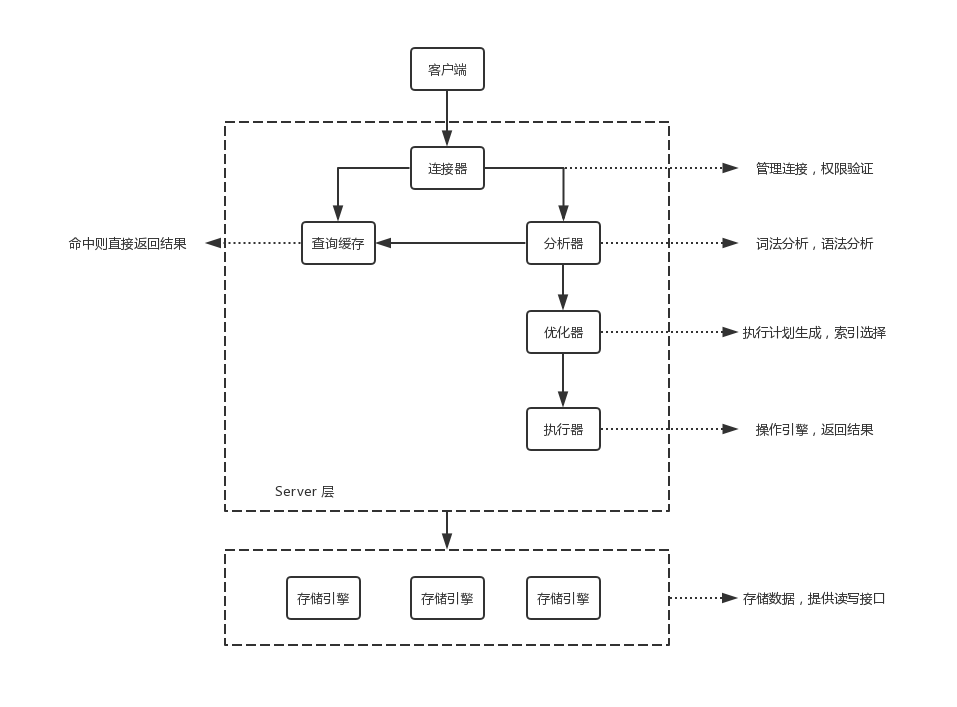

#  基础架构：一条SQL查询语句是如何执行的？



## 连接器

连接器负责根客户端建立连接、获取权限、维持和管理链接：

``` MySQL
mysql -h$ip -P$port -u$user -p
```

一个用户成功建立连接后，即使用管理员账号对这个用户的权限做了修改，也不会影响已经存在连接的权限。修改完成后，只有再新建立的连接才会使用心得权限设置。

## 查询缓存

MySQL 拿到一个查询请求后，会先到查询缓存查看，之前是否执行过这条语句。之前执行过的语句及其结果可能会以 key-value 对的形式，被直接缓存在内存中。key 是查询的语句，value 是查询的结果。

如果语句不在查询缓存中，就会继续后面的执行阶段。执行完成后，执行结果就会被存入查询缓存中。

大多数情况下不要使用查询缓存，因为查询缓存的失效非常频繁，只要有对一个表的更新，这个表上的所有查询缓存都会被清空。

MySQL 8.0 版本直接将查询缓存的整块功能删掉了。

## 分析器

分析器先回做『词法分析』，识别 SQL 语句中的关键字、表名、列名等内容；然后做『语法分析』，会根据语法规则，判断输入的 SQL 语句是否满足 MySQL 语法。

## 优化器

优化器是在表里面有过个索引的时候，决定使用哪个索引 ；或者在一个语句有过边关联的时候，决定各个表的连接顺序。

## 执行器

MySQL 通过分析器知道了你要做什么，通过优化器知道了该怎么做，于是就进入了执行器阶段，开始执行语句。

开始执行的时候，要先判断一下对将要执行的表是否有查询的权限，在工程实现上，如果命中查询缓存，会在查询缓存返回结果的时候做权限验证，查询也会在优化器之前调用 precheck 验证权限。
