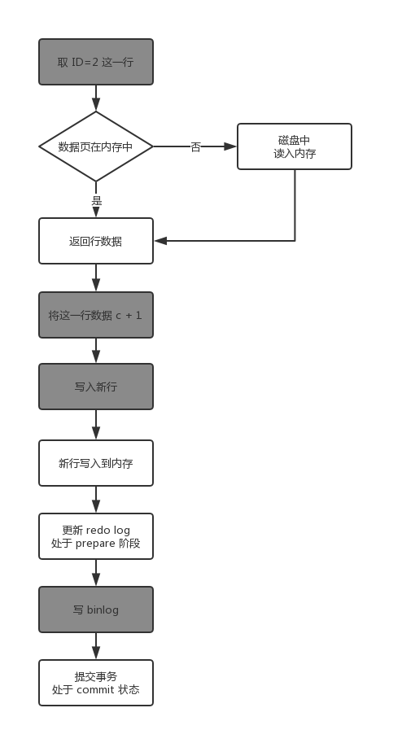

# 日志系统：一条SQL更新语句是如何执行的？

与查询流程不一样的是，更新流程还涉及两个重要的日志模块：`redo log`（重做日志）和`binlog`（归档日志）。

## 重要的日志模块：`redo log`

WAL 技术（Write-Ahead Logging）：先写日志，再写磁盘

具体来说，当有一条记录需要更新的时候，InnoDB 引擎就会先把记录写到 redo log 里面，并更新内存。同时，InnoDB 引擎会在适当的时候，将这个操作记录更新到磁盘里面，而这个更新往往是在系统比较空闲的时候做。

InnoDB 的 redo log 是固定大小的，比如可以配置为一组 4 个文件，每个文件大小是 1GB。从头开始写，写到末尾就又回到开头循环写。

有了 redo log，InnoDB 就可以保证即使数据库发生异常重启，之前提交的记录都不会丢失，这个能力成为 `crash-safe`。

## 重要的日志模块：`binlong`

MySQL 整体来看分为两块：一块是 Server 层，它主要做的是 MySQL 功能层面的事情；还有一块是引擎层，负责存储相关的具体事宜。上面提到的 redo log 是 InnoDB 引擎特有的日志，而 Server 层也有自己的日志，成为 binlog 归档日志。

因为最开始 MySQL 里并没有 InnoDB 引擎，MySQL 自带的引擎是 MyISAM，但是 MyISAM 没有 crash-safe 的能力，binlog 日志只能用于归档。而 InnoDB 是另一个公司以插件形式引入 MySQL 的，既然只依靠 binlog 是没有 crash-safe 能力的，所以 InnoDB 使用另外一套日志系统——也就是 redo log 来实现 crash-safe 能力。

两种日志有以下三点不同：

1. redo log 是 InnoDB 引擎特有的；binglog 是 MySQL 的 Server 层实现的，所有引擎都可以使用。
2. redo log 是物理日志，记录的是『在某个数据页上做了什么修改』；binlog 是逻辑日志，记录的是这个语句的原始逻辑。
3. redo log 是循环写的，空间固定会用完；binlog 是可以追加写入的。『追加写』是指 binlog 文件写到一定大小后会切换到下一个，并不会覆盖以前的日志。

``` sql
update T set c=c+1 where ID=2;
```

针对这条 update 语句的执行过程如下图，途中浅色框表示在 InnoDB 内部执行的，深色框表示在执行器中执行的。



最后三步将 redo log 的写入拆成了两个步骤：prepare 和 commit，这就是『两阶段提交』。

两阶段提交是为了让两份日志之间的逻辑一致。redo log 和 binlog 都可以用于表示事务的提交状态，而两阶段提交就是让这两个状态保持逻辑的一致。


